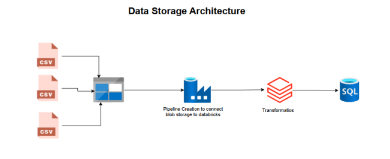
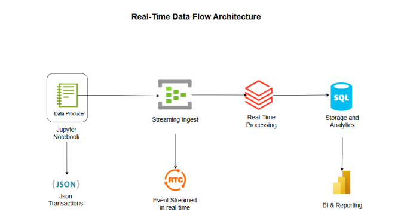
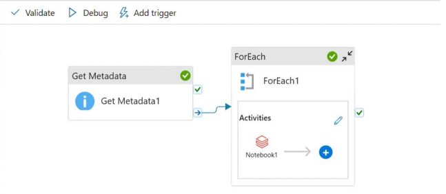
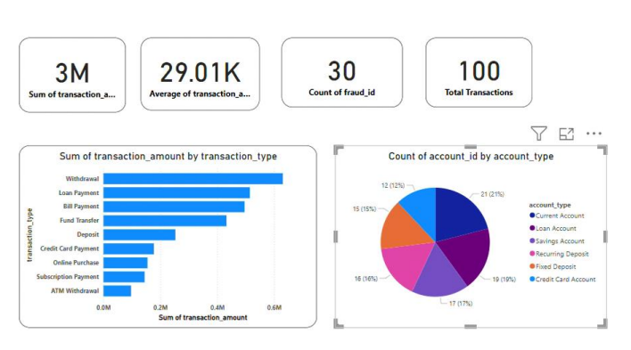
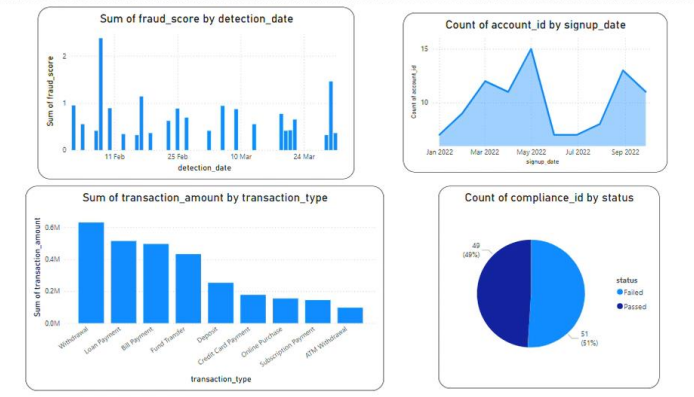
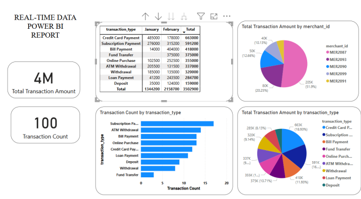

# Project Title
Scalable ETL and Real-Time Analytics for Financial Data
## Description
Financial institutions process vast amounts of transactional data daily, requiring a scalable, real-time solution for fraud detection, risk assessment, and regulatory compliance. The challenge is to 
efficiently ingest, process, and analyze data from multiple sources while ensuring security, 
scalability, and cost-effectiveness. This project aims to build an end-to-end Azure-based ETL and 
analytics pipeline to enable real-time fraud detection and data-driven decision-making
## Medallion Architecture

## Data Storage

Azure Services Used:
1. Azure DataLake Storage
2. Azure DataFactory
3. Databricks
4. Azure Sql Database

## Real-Time Dataflow

Services Used:
1. Jupyter Notebook for Producer code
2. Azure Event Hub
3. Databricks
4. Azure Sql Database

## ETL Pipeline

This Pipeline is created for actual data transfer from (ADLS)Azure Data lake storage to databricks for transformation.The pipeline is created in Azure data factory.All the transformed data is transfered to Sql database and then forwarded to PowerBi for reporting and analysis.

## PowerBi Dashboard

