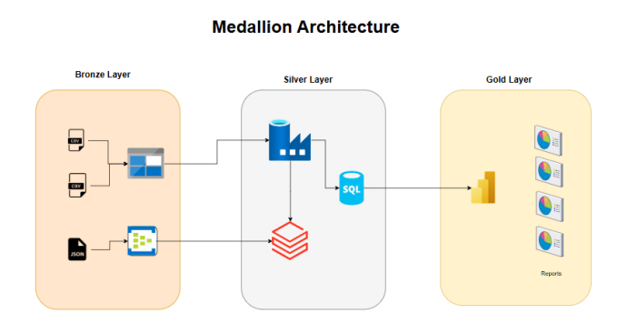

# Project Title
Scalable ETL and Real-Time Analytics for Financial Data
## Description
Financial institutions process vast amounts of transactional data daily, requiring a scalable, realtime solution for fraud detection, risk assessment, and regulatory compliance. The challenge is to 
efficiently ingest, process, and analyze data from multiple sources while ensuring security, 
scalability, and cost-effectiveness. This project aims to build an end-to-end Azure-based ETL and 
analytics pipeline to enable real-time fraud detection and data-driven decision-making
## Medallion Architecture

## Data Storage

